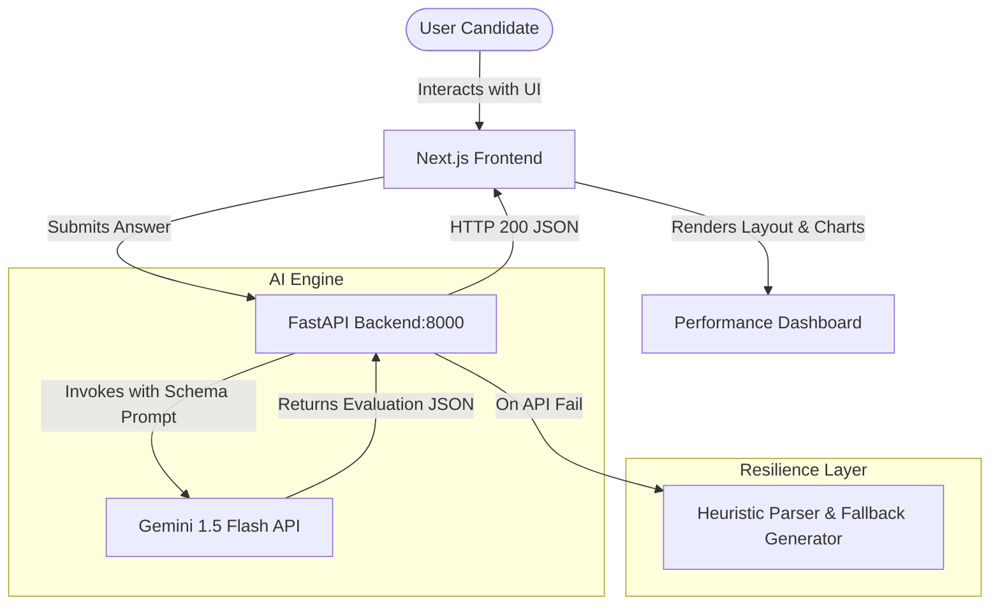

# <p align="center">🧠 MockMate — Ace Your Interviews with AI 🚀</p>

<p align="center">
  
  
  
  
  
</p>

---

**MockMate** is a state-of-the-art AI-powered interview simulator that helps developers practice coding, system design, and behavioral questions with real-time feedback. Designed with a premium glassmorphic UI, fluid framer-motion micro-animations, and a Python FastAPI analysis engine powered by Gemini.

## 🌟 Core Features

- **⚡ Real-Time Cognitive Analytics:** Instant feedback on technical precision, communication flow, confidence metrics, and structural correctness.
- **📄 Resume-Tailored Assessment:** Scan and parse your PDF resume, dynamically seeding deep-dive project-based questions.
- **🎯 Professional Rubrics:** Specialized training for Frontend, Backend, Machine Learning, HR Leadership, and Product Manager interview tracks.
- **📊 Performance Analytics:** Historical charts visualizing your score patterns, technical depth, and confidence levels over multiple runs.
- **⚡ Zero-Fail Fallback Engine:** Smart local heuristics return premium structural evaluations even during upstream AI provider service disruptions.

---

## 🏗️ Architecture Design



---

## 🛠️ Tech Stack & Dependencies

| Layer | Technologies |
|---|---|
| **Frontend** | Next.js 16 (App Router), React 19, Tailwind CSS v4, Framer Motion, Lucide React, Canvas Confetti |
| **Backend** | Python 3.10+, FastAPI, Uvicorn, Pydantic, Python-Requests |
| **AI Model** | Google Gemini 1.5 Flash (via API) |
| **Deployment** | Vercel (Frontend), FastAPI Host (Backend) |

---

## 📂 Project Structure

```
├── backend/
│   ├── main.py          # FastAPI Evaluation Engine
│   └── .env.example     # Environment template (GEMINI_API_KEY)
├── src/
│   ├── app/             # Next.js App Router Pages (Interview, Roles, Analytics)
│   ├── components/      # UI components (Navbar, GridBackground, BentoCards)
│   ├── lib/             # API client handlers
│   └── globals.css      # Core Design System & Tailwind v4 Custom Tokens
├── package.json
└── tsconfig.json
```

---

## 🚀 Setup & Installation

### 1. Clone & Set Up Backend

```bash
# Navigate to backend
cd backend

# Create local environment configuration
cp .env.example .env
# Edit .env and paste your GEMINI_API_KEY

# Install dependencies (FastAPI, Uvicorn, Requests)
pip install fastapi uvicorn requests pydantic

# Launch the FastAPI server
python -m uvicorn main:app --port 8000 --reload
```

The backend server will run online at `http://127.0.0.1:8000`.

### 2. Set Up Frontend

```bash
# In the root project directory
npm install

# Run the Next.js development server
npm run dev
```

Open [http://localhost:3000](http://localhost:3000) with your browser to experience **MockMate**.

---

<p align="center">Made with ❤️ by the MockMate Dev Team</p>
